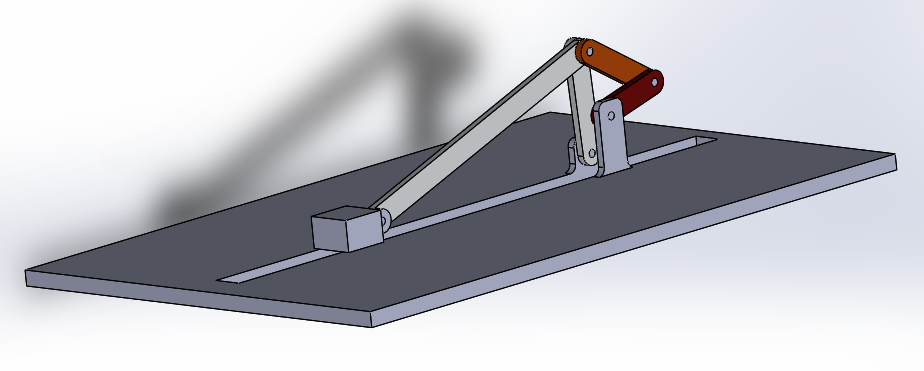
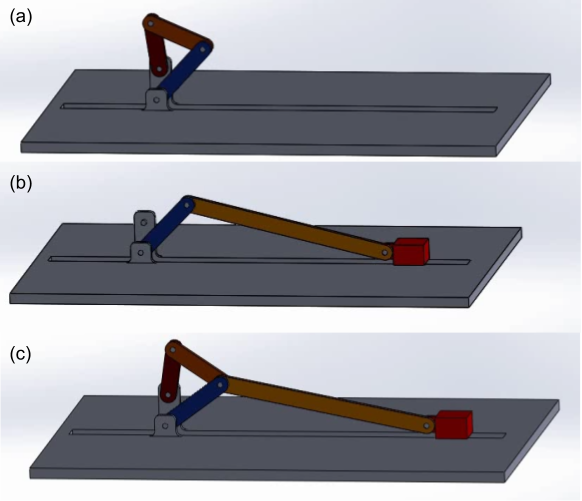

# Introduction

This work titled as "Design and Fabrication of Experiment for Dynamic Analysis of Mechanisms " has been undertaken jointly by [Aakash Yadav](http://nimrobotics.github.io/) and Akhil Akunuru under the guidance of [Prof. Sriram Sundar](https://iittp.ac.in/dr-sriram-sundar).

|website| GitHub |
|--|--|
| [https://nimrobotics.github.io/BTP/](https://nimrobotics.github.io/BTP/) | [https://github.com/nimRobotics/BTP](https://github.com/nimRobotics/BTP) |

## Motivation and objective

The study of the *"Kinematics and Dynamics of Machinery" (IITT course code: ME2206)* lies at the very core of a mechanical engineering
background. Although, little has changed in the way the subject is presented, our methodology brings the subject alive and current. We
present the design and fabrication of a novel experimental setup for carrying out static, kinematic and dynamic analysis of three different
mechanisms in a single setup (Figure <a href="#cad_ful" data-reference-type="ref" data-reference="cad_ful">1</a>). The mechanism is designed to be configurable to three different types of mechanisms namely - double crank, slider crank and a six bar mechanism depending on the use case as shown in Figure <a href="#cad_all" data-reference-type="ref" data-reference="cad_all">2</a>. The mechanism has retrofitted parts (different link lengths and sliders) to facilitate multiple experiments in the same setup.

The learner gets to "play" with the mechanism parameters and immediately understand their effects. This will enhance one’s grasp of the concepts
and the development of analytical skills. Hence greatly supplementing and reinforcing the theoretical understanding of the undergraduate
students taking the course.

<figure align="center">
<figcaption>1. CAD model of the mechanism</figcaption>
</figure>

<figure align="center">
<figcaption>2. Three possible configurations of the mechanism: (a) Four bar, (b) Slider crank and (c) Six bar</figcaption>
</figure>

## Present method(s) and challenges

In the present scenario finding standard mechanisms integrated with different sensor measurements and data acquisition is hard to find.
Almost all the mechanisms that are available off-the-shelf do not have any data measurement capability and thus can only be used for
demonstrations purpose and not as an experimental setup. 

In chapter 2 we present thoroughly all the methodologies used in designing and modeling the mechanisms. This includes both the analysis
carried out by analytical as well as numerical methods. In the chapter that follows we bring out the various design considerations that have to
be taken into account while manufacturing the product. The final two sections present the result(s) and the conclusion(s).